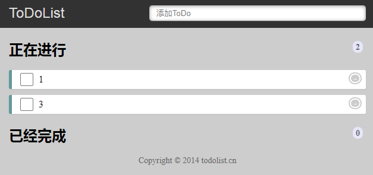

# todolist

这里采用vuex写了一个简单的demo：todolist，详细功能参见http://www.todolist.cn/

目的：将vuex所学内容（state、getters、mutations）用起来

结果：index存在小bug，index_2可以正常实现功能

## 程序主要功能：

1. 在上方键入文字按下回车键后将文字添加至正在进行列表中
2. 点击正在进行（已经完成）中的选中框，实现事项在正在进行与已经完成之间的来回切换
3. 点击正在进行（已经完成）中事项末尾的删除符号，将事项从所在列表中删除
4. 对正在进行（已经完成）列表中事项进行计数。

## 项目组成：

涉及知识：html、css、vue、vuex

其中html完成最基本的页面结构

css完成对页面的布局与美化

vue和vuex主要实现视图层与数据层间的逻辑关系与渲染

## 步骤：

* 创建单一状态树store
  1. 添加state，添加数组（total），数组元素为对象，用来存放用户的输入（text）、该输入的待办状态（state）及id索引（id）
  2. 添加getters，对state中的数组进行处理，分别得到正在进行数组（undone）、已经完成数组（done）、正在进行计数（undoneCount）、已经完成计数（doneCount）
  3. 添加mutations，包含5个操作分别是：
     * addList：将用户的输入以对象形式存入total数组
     * undoneChange：将指定对象移入done数组中
     * doneChange：将指定对象移入undone数组中
     * undoneDelete：将指定对象从total数组中删除
     * doneDelete（整理后发现与undoneDelete操作重复，后续可以删除）：将指定对象从total数组中删除

* 创建子组件undoneItem及doneItem
  * 接收父组件传入的text（将total中的用户输入渲染进p标签中，采用计算属性及index，可以不需要父组件传入text，后续会修改）及index（告诉后续逻辑任务，我点击的是哪一个li标签，对应total中的哪个对象）
  * 将store注入子组件
  * 创建模板、模板中分别添加两个点击事件
  * 添加方法，当点击事件触发时，提交mutation操作，对store中数据进行更改
* 创建父组件vm
  * 绑定dom元素
  * 注入store
  * 绑定子组件
  * 添加事件处理方法，当用户输入并桥下回车，提交mutation操作，将数据存入state中

## 注：

所用脚本版本：vuex v3.6.2，Vue.js v2.6.12

## 总结

* 目前仅使用了vuex中的3个基本内容，不过相较于采用vue的todolist，采用vuex方法，大大减少了父组件向子组件传递数据以及子组件向父组件传递事件及数据的操作

* 对于vue的dom元素渲染问题存在一定的困惑，index与index_2写法不同，index中出现了input勾选框渲染显示错误的问题，在子组件标签中添加key也没解决问题，index_2没有引入key也没出现渲染错误

